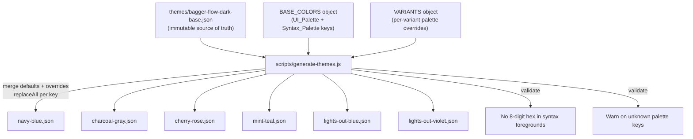

# Design Document: Theme Generation Refactor

## Overview

This refactor restructures the Bagger Flow theme generation pipeline around three goals:

1. Make the base theme's role as an immutable source of truth explicit by renaming `classic.json` → `base.json` and removing it from `package.json` contributions.
2. Promote navy blue from a verbatim mirror copy to a proper variant entry in the `VARIANTS` object, giving it its own palette that can diverge independently.
3. Extend `BASE_COLORS` with syntax palette keys so that variants can override foreground/syntax highlighting colors — not just UI/chrome colors.

The generation script's core architecture (single-pass `replaceAll` over the base theme JSON string) remains unchanged. The refactor widens the set of colors that pass through that pipeline and adds lightweight validation for palette completeness and unknown keys.

## Architecture



The key change is that `BASE_COLORS` grows from ~14 UI-only keys to ~14 UI keys + ~20 syntax keys. Each variant's `colors` object remains a sparse override map — omitted keys fall back to the base defaults automatically.

### Generation Flow (updated)

1. Read `themes/bagger-flow-dark-base.json` as a UTF-8 string.
2. Validate the base theme has no 8-digit hex syntax foregrounds.
3. For each variant in `VARIANTS`:
   a. Build a merged palette: `{ ...BASE_COLORS, ...variant.colors }`.
   b. For each key in `BASE_COLORS`, `replaceAll(bare(baseValue), bare(mergedValue))` on the theme string.
   c. Validate the result has no 8-digit hex syntax foregrounds.
   d. Write the result to `themes/{variant.output}`.
4. Log warnings for any keys in `variant.colors` not present in `BASE_COLORS`.

Navy blue is now just another entry in `VARIANTS` whose palette values happen to match the base defaults (producing identical output). The dedicated `fs.writeFileSync(NAVY_MIRROR, baseContent)` mirror-copy line is removed.

## Components and Interfaces

### 1. `BASE_COLORS` constant (expanded)

The existing `BASE_COLORS` object is extended with syntax palette keys. The keys are split into two logical groups via comments but live in a single flat object:

```js
const BASE_COLORS = {
  // ── UI Palette ──
  accent:           "#1479b8",
  accentAlt:        "#247bce",
  chromeBg:         "#14171c",
  editorBg:         "#161b23",
  miscBg:           "#161b22",
  border:           "#30363d",
  secondaryBg:      "#21262d",
  highlight:        "#153051",
  deepestBg:        "#101318",
  statusBg:         "#101016",
  widgetBg:         "#1f242b",
  emptyBg:          "#242730",
  scrollbarMuted:   "#bec7da",
  overviewRulerBg:  "#12171e",

  // ── Syntax Palette ──
  syntaxVariable:       "#f0f0f0",
  syntaxComment:        "#80808F",
  syntaxConstVar:       "#ffeeff",
  syntaxConstant:       "#ff789e",
  syntaxNumber:         "#60A5FA",
  syntaxUnit:           "#aaffff",
  syntaxTagPunctuation: "#747484",
  syntaxString:         "#61e57e",
  syntaxKeyword:        "#BB88FF",
  syntaxFunction:       "#55ffff",
  syntaxProperty:       "#ff3675",
  syntaxType:           "#11cfa9",
  syntaxAltSymbol:      "#ff8f63",
  syntaxCssVendor:      "#bbddec",
  syntaxBuiltinProp:    "#ff8888",
  syntaxComplementary:  "#13dfac",
  syntaxMarkupAlt:      "#888899",
  syntaxLiquidOutput:   "#a2b8c9",
  syntaxLiquidValue:    "#eeffff",
}
```

Each syntax key maps to exactly one foreground hex value used in the base theme's `tokenColors`. The `replaceAll` mechanism handles all occurrences of that hex value across both `colors` and `tokenColors` sections — no special routing needed.

### 2. `VARIANTS` object (updated)

Each variant entry gains optional syntax palette keys alongside the existing UI keys:

```js
const VARIANTS = {
  "navy-blue": {
    label: "Bagger Flow",
    output: "bagger-flow-dark--navy-blue.json",
    colors: {
      // All keys omitted — uses base defaults, producing identical output
    },
  },
  "gray-slate": {
    label: "Bagger Flow Dark: Charcoal Gray",
    output: "bagger-flow-dark--charcoal-gray.json",
    colors: {
      // existing UI overrides ...
      // optional syntax overrides, e.g.:
      // syntaxString: "#7ee89a",
    },
  },
  // ... other variants
}
```

### 3. Palette merge + default fallback

Before running `replaceAll`, the script merges each variant's sparse `colors` with `BASE_COLORS`:

```js
const merged = { ...BASE_COLORS, ...variant.colors }
```

This means omitted keys automatically retain the base value, and the `replaceAll(base, base)` for those keys is a no-op.

### 4. Unknown key warning

After merging, the script checks for keys in `variant.colors` that don't exist in `BASE_COLORS`:

```js
for (const key of Object.keys(variant.colors)) {
  if (!(key in BASE_COLORS)) {
    console.warn(`Warning: variant "${variantKey}" contains unknown palette key "${key}"`)
  }
}
```

### 5. `assertOpaqueSyntaxForegrounds` (unchanged)

The existing validation function remains as-is. It already scans `tokenColors` and `semanticTokenColors` sections for 8-digit hex foreground values and throws a descriptive error.

### 6. `BASE_THEME` constant (updated path)

```js
const BASE_THEME = path.join(THEMES_DIR, "bagger-flow-dark-base.json")
```

The `NAVY_MIRROR` constant and its `fs.writeFileSync` call are removed entirely.

## Data Models

### Palette Key Schema

Each key in `BASE_COLORS` is a camelCase identifier mapping to a 6-digit hex color string (`#RRGGBB`). No alpha channel is permitted for syntax palette keys.

```
PaletteKey   = string (camelCase identifier)
PaletteValue = string (matches /^#[0-9a-fA-F]{6}$/)
```

### Variant Schema

```
Variant = {
  label:  string          // VS Code theme picker display name
  output: string          // output filename in themes/
  colors: Record<PaletteKey, PaletteValue>  // sparse override map
}
```

### File Mapping

| File | Role | Shipped? |
|------|------|----------|
| `themes/bagger-flow-dark-base.json` | Immutable source of truth | No |
| `themes/bagger-flow-dark--navy-blue.json` | Generated variant (default) | Yes |
| `themes/bagger-flow-dark--charcoal-gray.json` | Generated variant | Yes |
| `themes/bagger-flow-dark--cherry-rose.json` | Generated variant | Yes |
| `themes/bagger-flow-dark--mint-teal.json` | Generated variant | Yes |
| `themes/bagger-flow-dark--lights-out-blue.json` | Generated variant | Yes |
| `themes/bagger-flow-dark--lights-out-violet.json` | Generated variant | Yes |


## Correctness Properties

*A property is a characteristic or behavior that should hold true across all valid executions of a system — essentially, a formal statement about what the system should do. Properties serve as the bridge between human-readable specifications and machine-verifiable correctness guarantees.*

### Property 1: Palette completeness covers all syntax foregrounds

*For any* foreground hex value appearing in the base theme's `tokenColors` section, there SHALL exist a corresponding key in `BASE_COLORS` whose value matches that hex.

**Validates: Requirements 3.1**

### Property 2: Syntax palette substitution correctness

*For any* variant that specifies a syntax palette key override, the generated theme output SHALL contain the overridden color value in every position where the base theme contained the original color for that key, and SHALL NOT contain the original base color for that key.

**Validates: Requirements 3.2**

### Property 3: Omitted palette keys retain base defaults

*For any* variant whose `colors` object omits a key present in `BASE_COLORS`, the generated theme output SHALL be identical to the base theme for all occurrences of that key's color value.

**Validates: Requirements 3.3, 4.1**

### Property 4: 8-digit hex syntax foreground rejection

*For any* palette override that produces an 8-digit hex value (`#RRGGBBAA`) in a `tokenColors` or `semanticTokenColors` foreground scope, the generation script SHALL throw an error with a message identifying the offending value.

**Validates: Requirements 3.5**

### Property 5: Unknown palette key warning

*For any* variant whose `colors` object contains a key not present in `BASE_COLORS`, the generation script SHALL log a warning message containing both the unknown key name and the variant name.

**Validates: Requirements 4.2**

## Error Handling

| Condition | Behavior |
|-----------|----------|
| Base theme file missing | `fs.readFileSync` throws — script exits with Node.js file-not-found error |
| 8-digit hex foreground in base theme | `assertOpaqueSyntaxForegrounds` throws before any variant is generated |
| 8-digit hex foreground in generated variant | `assertOpaqueSyntaxForegrounds` throws for that variant; previously written variants are unaffected |
| Unknown key in variant `colors` | `console.warn` with key name and variant name; generation continues |
| Omitted key in variant `colors` | Silent fallback to base default via spread merge; no warning |
| Variant output write failure | `fs.writeFileSync` throws — script exits with Node.js I/O error |

No new error types are introduced. The existing `assertOpaqueSyntaxForegrounds` function already handles the 8-digit hex case. The only new behavior is the `console.warn` for unknown keys.

## Testing Strategy

### Unit Tests (example-based)

Use Node.js built-in `node:test` + `node:assert` (no external dependencies needed):

1. **Base path constant** — verify `BASE_THEME` resolves to `bagger-flow-dark-base.json` (Req 1.1, 1.3)
2. **Navy blue variant entry** — verify `VARIANTS["navy-blue"]` exists with correct label, output, and empty/base-matching colors (Req 2.1)
3. **Navy blue identity** — generate navy-blue variant, assert output equals base theme content (Req 2.2)
4. **No mirror-copy code** — assert the generate script source does not contain `NAVY_MIRROR` or verbatim copy logic (Req 2.3)
5. **Package.json correctness** — assert `contributes.themes` does not reference `classic.json`, does reference `navy-blue.json` with label `Bagger Flow` (Req 1.2, 2.4, 5.1, 5.2)
6. **Variant-to-package.json sync** — assert every VARIANTS entry has a corresponding `contributes.themes` entry (Req 5.3)
7. **Steering doc references** — assert steering docs reference `base.json`, mention Syntax_Palette, and describe navy blue as a variant (Req 6.1, 6.2, 6.3)

### Property-Based Tests

Use `fast-check` for property-based testing. Each test runs a minimum of 100 iterations.

- **Property 1** (palette completeness): Parse base theme tokenColors, extract foreground values, verify each exists in BASE_COLORS values.
- **Property 2** (substitution correctness): Generate arbitrary color overrides for syntax keys, run substitution, verify output contains overridden colors.
- **Property 3** (default fallback): Generate variants with random subsets of keys omitted, verify omitted key colors are unchanged.
- **Property 4** (8-digit hex rejection): Generate 8-digit hex values as syntax overrides, verify `assertOpaqueSyntaxForegrounds` throws.
- **Property 5** (unknown key warning): Generate random unknown key names, verify warning is logged with key and variant name.

Tag format: `Feature: theme-generation-refactor, Property {N}: {title}`
