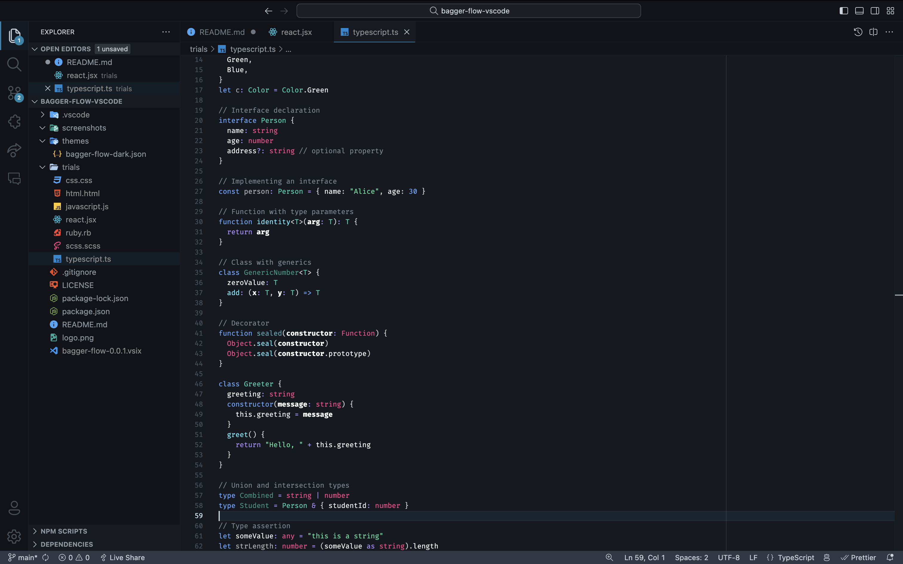

# Bagger Flow Themes

A clean and minimal dark theme for Visual Studio Code.

## Changelog

### 1.0.0

First release of the theme. General support for most languages and careful support for HTML, CSS, and JS/TS, JSX/TSX and Ruby.

## Installation

VS Code Marketplace:

## Screenshots

### Bagger Flow Dark

## Inspiration

- Tailwind Moon: https://github.com/luciascarlet/tailwind-moon-vscode/tree/main/themes
- GitHub Dark Mode: https://github.com/markusylisiurunen/github-dark-mode/blob/main/themes/github-dark-mode.json
