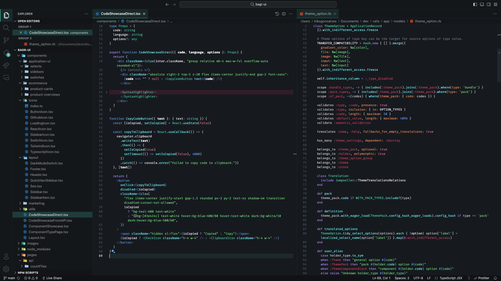

# Bagger Flow Themes

A clean and minimal dark theme for Visual Studio Code with carefully tailored syntax highlight.

## Installation

VS Code Marketplace: https://marketplace.visualstudio.com/items?itemName=kikogoncalves.bagger-flow

## Screenshots

### Bagger Flow Dark

## Inspiration

- Tailwind Moon: https://github.com/luciascarlet/tailwind-moon-vscode/tree/main/themes
- GitHub Dark Mode: https://github.com/markusylisiurunen/github-dark-mode/blob/main/themes/github-dark-mode.json

## Changelog

### 0.0.11

- Change JS this syntax color.
- Change CSS property name color.
- Change support built-in syntax color.

### 0.0.10

- Change git merge conflict colors.

### 0.0.9

- Change primary color

### 0.0.8

- Refined syntax colors.

### 0.0.7

- Refined syntax colors.

### 0.0.6

- Refined colors for editor.

### 0.0.5

- Change constant primary colors.

### 0.0.4

- Color bundles and refinements.

### 0.0.3

- Semantic color changes.

### 0.0.2

- Slightly lighter editor colors.
- Improved Liquid syntax support.

### 0.0.1

- First release of the theme.
- General support for most languages and careful support for HTML, CSS, and JS/TS, JSX/TSX and Ruby.
