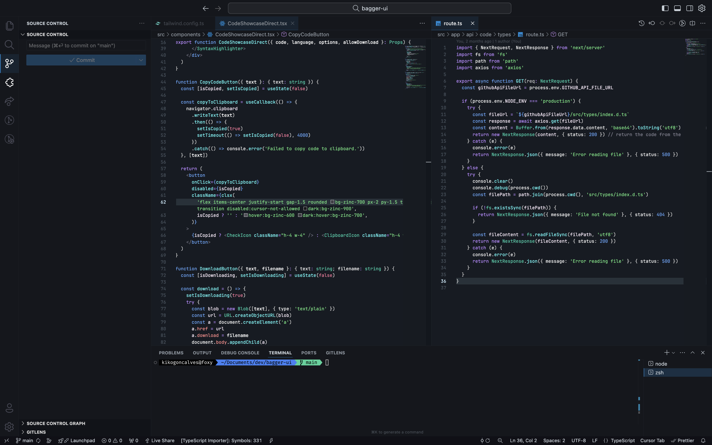
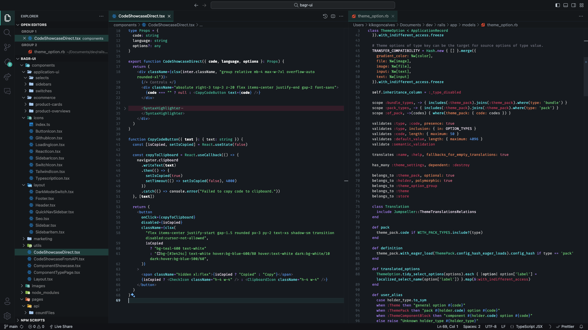

# Bagger Flow

A dark theme for VS Code — clean, colorful, and easy on the eyes. Built with careful syntax highlighting for the languages I use every day.

Tailored, slick, modern, homey, with great variants.

## Variants

Bagger Flow ships with five dark variants, all generated from a single base theme:

- **Bagger Flow** the default. Deep navy tones with vibrant syntax colors.
- **Charcoal Gray** — a neutral, zinc-toned take for when navy feels like too much.
- **Cherry Rose** — warm reds and rose accents for a cozier vibe.
- **Mint Teal** — cool teal tones if you lean toward greens and cyans.
- **Petrol Blue** — near-black gunmetal with electric blue accents.

Pick whichever fits your mood — they all share the same syntax logic under the hood.

## Supported Languages

HTML, CSS, SCSS, JavaScript, TypeScript, JSX/TSX, Ruby, and Liquid.

## Screenshots

## Installation

Install from the [VS Code Marketplace](https://marketplace.visualstudio.com/items?itemName=kikogoncalves.bagger-flow) or search "Bagger Flow" in the extensions panel.

## Inspiration

- [Tailwind Moon](https://github.com/luciascarlet/tailwind-moon-vscode/tree/main/themes)
- [GitHub Dark Mode](https://github.com/markusylisiurunen/github-dark-mode/blob/main/themes/github-dark-mode.json)

## Changelog

See [CHANGELOG.md](./CHANGELOG.md) for version history.

## Author

Made by [Kiko Gonçalves](https://kikogoncalves.com).
